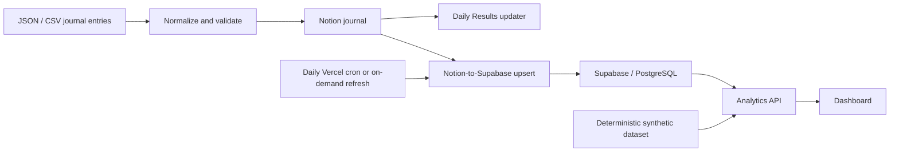

# Trading Analytics & Workflow Automation Platform

Workflow automation and analytics platform that validates journal data, synchronizes Notion with Supabase/PostgreSQL, and delivers recurring dashboard insights.

[](https://github.com/Ruixing0328/trading-analytics-workflow-automation/actions/workflows/ci.yml)
[View the synthetic demo](https://trading-analytics-workflow-automati.vercel.app/)


> **Synthetic demo data — illustrative results only.** Every public performance figure and dashboard record is generated for demonstration. No personal trading history or account data is included.

## One-minute overview

Reviewing a journal manually meant repeatedly collecting entries, checking field consistency, reconciling daily results, and rebuilding the same performance summaries. This project turns that recurring operational workflow into a structured analytics system:

**JSON/CSV entries → validation and normalization → Notion journal → Supabase/PostgreSQL synchronization → analytics API → dashboard and recurring scorecards**

The trading journal is the use case. The broader engineering story is how a fragmented manual process became a repeatable data pipeline with API integrations, validation, duplicate controls, idempotent database updates, and decision-support reporting.

## What the platform automates

- Validates and normalizes single or batch journal entries with Pydantic before any external write.
- Creates and checks a canonical Notion database schema, ingests JSON/CSV data, and optionally attaches screenshots.
- Handles duplicate journal records with explicit `reject`, `skip`, and `upsert` modes.
- Creates or updates the matching Notion Daily Results page after a journal write.
- Reads paginated Notion data, transforms nested properties into stable relational fields, and upserts batches into Supabase/PostgreSQL by Notion page ID.
- Refreshes private data on demand and includes a bearer-protected reference endpoint for a daily `03:00 UTC` Vercel cron deployment.
- Serves filtered KPIs, trends, weekly/monthly scorecards, and process breakdowns through a Python analytics API and a lightweight JavaScript dashboard.

There is no brokerage execution, strategy automation, signal generation, emailed report, scheduled weekly job, or AI/LLM component.

## Architecture and data flow



The live path is designed for private deployment: Notion remains the journal system of record, and the Supabase table remains protected behind row-level security and server-side credentials. The hosted public path enters at the synthetic dataset and uses the same Python analytics functions without reading Notion or Supabase configuration.

## Workflow triggers and repeatability

| Trigger | Automated result |
|---|---|
| Single or batch journal write | Validate fields, apply duplicate policy, write to Notion, refresh Daily Results, and upsert the saved page to Supabase when configured |
| Local dashboard refresh | Throttled Notion-to-Supabase synchronization in private live mode, followed by the latest analytics payload |
| Private daily cron | Full paginated Notion read, transformation, batched upsert, and synchronization summary |
| Public demo request | Regenerate the fixed synthetic dataset and return a filtered, shaped analytics payload |

Notion duplicate prevention uses date, instrument, direction, entry time, and—when present—account type and label. Historical records without an entry timestamp cannot use the strongest duplicate key, so imports of those rows require additional review. Supabase synchronization is repeatable because records are upserted on their Notion page ID.

## Analytics and decision support

The dashboard calculates and presents:

- trade count, net and average P&L;
- decisive-outcome win rate, gross profit/loss, and profit factor;
- average realized R and average hold time;
- win/loss streaks, cumulative equity, and maximum drawdown;
- weekly and monthly scorecards;
- results by instrument, time window, setup grade, emotional state, and weekday;
- process and discipline flags such as forced trades, overtrading, chasing, and position-size adherence.

“Expectancy” is the observed average P&L per trade. Win rate excludes breakeven outcomes from its denominator. Maximum drawdown is measured from the running peak of cumulative P&L. Weekly and monthly views are calculated dynamically in the dashboard rather than produced by separate scheduled jobs.

## Integration and reliability details

- **Notion API:** database creation, schema validation, pagination, rich-property mapping, file upload, page create/update, and retry handling.
- **Supabase/PostgreSQL:** normalized relational storage, server-side REST access, batched writes, and page-ID-based upserts.
- **Analytics API:** one shaped payload shared by the local dashboard and public serverless demo endpoint.
- **Failure handling:** validation errors stop unsafe writes; schema mismatches are surfaced; batch imports can optionally continue after row-level failures; sync/API requests use bounded retries.
- **Privacy boundary:** browser code never receives database credentials or connects directly to Supabase.

## Tech stack

- Python 3.9+
- Pydantic
- Notion API
- Supabase / PostgreSQL
- Vanilla JavaScript, HTML, and CSS
- Vercel Python Functions and cron reference configuration
- pytest and GitHub Actions

## Synthetic public demo

The checked-in [`examples/demo_trades.json`](examples/demo_trades.json) contains 48 deterministic trades spanning approximately eight weeks. It uses only `Papertrade` and `Backtest` account types, synthetic IDs, neutral performance, and enough field variety to exercise filters, drawdowns, scorecards, process fields, and discipline flags.

Regenerate it at any time:

```bash
python scripts/generate_demo_dataset.py
```

Tests verify that the committed export exactly matches the generator, stays within neutral performance bounds, and contains no Notion URLs, screenshots, private identifiers, or real account labels.

## Quickstart

Create an environment and install the project:

```bash
python -m venv .venv
source .venv/bin/activate
python -m pip install -e .
```

Run the dashboard safely with no external credentials:

```bash
python scripts/run_dashboard.py --demo
```

Then open `http://127.0.0.1:8765`. With no `--demo`, no snapshot, and no Supabase credentials, the server also falls back safely to synthetic data.

An explicit local-only snapshot can be supplied without placing it in the repository:

```bash
python scripts/run_dashboard.py --snapshot /absolute/path/to/private_snapshot.json
```

## Private integration configuration

Copy `.env.example` to `.env` and fill only the settings required for your private environment. `.env` and common export formats are ignored by Git.

```bash
cp .env.example .env
```

Key server-only variables are `NOTION_TOKEN`, `NOTION_TRADE_JOURNAL_DATA_SOURCE_ID`, `SUPABASE_URL`, and `SUPABASE_SERVICE_ROLE_KEY`. `CRON_SECRET` protects the optional private synchronization endpoint. Never expose the service-role key to browser code.

Representative commands:

```bash
# Validate a payload and preview its Notion request without writing
python scripts/push_trade.py examples/sample_trade.json --dry-run

# Import JSON or CSV with an explicit duplicate policy
python scripts/import_batch.py examples/sample_batch.json --duplicate-mode skip

# Run a full private Notion-to-Supabase synchronization
python scripts/sync_supabase.py
```

Additional commands create the canonical Notion database and attach a screenshot to an existing journal page. The SQL schema in `supabase/trade_journal_trades.sql` is private-deployment material: it enables row-level security and intentionally provides no anonymous browser grants.

The public `vercel.json` powers the dashboard from synthetic data and schedules no live synchronization. The protected sync handler remains dormant without server-only secrets. `deployment/vercel.private-cron.example.json` preserves the daily private-deployment schedule as reference material; it should only be used with server-side secrets configured in a private Vercel project.

## Testing

```bash
python -m pytest
node --check dashboard/dashboard.js
```

The focused suite covers normalization and validation, Notion mappings and retries, schema checks, duplicate modes, Daily Results generation, Supabase transformations/upserts, dashboard metrics and source modes, synthetic-data safety, serverless API behavior, and public asset boundaries. GitHub Actions runs the Python tests and JavaScript syntax check on pushes and pull requests.

## Repository map

```text
api/                         Synthetic dashboard API and private sync reference
dashboard/                   Recruiter-facing analytics UI
deployment/                  Private cron reference configuration
examples/                    Synthetic input and generated demo data
scripts/                     Operational CLI entry points
src/notion_trade_journal/    Validation, integrations, pipeline, and analytics logic
supabase/                    Protected relational schema
tests/                       Focused reliability and public-safety tests
```

## Privacy model, limitations, and disclaimer

- The public demo never queries Notion or Supabase and contains no real trading records, account balances, screenshots, or personal P&L.
- Private deployments must keep the Supabase table behind row-level security and use service-role credentials only on the server.
- Screenshot URLs and raw Notion page payloads are retained in the private operational schema because they are part of the real synchronization implementation; they are not returned by the public demo.
- The supported instrument, field, and category enums reflect this journal implementation rather than a general-purpose trading data standard.
- The project demonstrates data analytics and workflow automation. It does not provide investment advice, trading signals, or evidence of investment performance.
