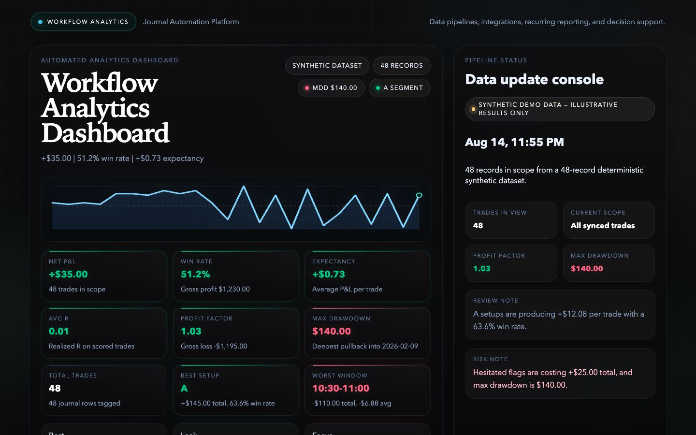
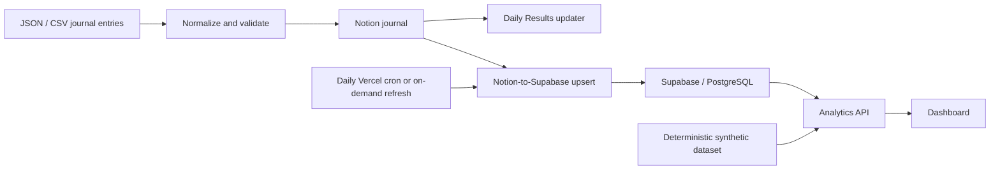

# Trading Analytics & Workflow Automation Platform

I built this project to automate a manual trading-journal workflow and make the underlying data easier to analyze consistently. What started as manually entering trades, checking data, updating daily results, and rebuilding performance summaries became a pipeline connecting Notion, Supabase/PostgreSQL, and a custom analytics dashboard.

The system validates journal entries before they are written, keeps data synchronized across systems, handles duplicate records and recurring updates, and turns the resulting data into performance and process analytics.

[](https://github.com/Ruixing0328/trading-analytics-workflow-automation/actions/workflows/ci.yml)

[View the synthetic demo](https://trading-analytics-workflow-automati.vercel.app/)



> **Synthetic demo data — illustrative results only.** The public dashboard uses generated data and does not include my personal trading history, account data, or P&L.

## Overview

The original workflow involved a lot of repetitive work: collecting journal entries, checking that fields were formatted correctly, updating daily results, and recreating the same performance summaries.

I wanted to automate that process while keeping the underlying data structured enough to analyze consistently.

The workflow now looks like this:

**JSON/CSV entries → validation → Notion → Supabase/PostgreSQL → analytics API → dashboard**

Although trading is the use case, most of the project is focused on **data validation, API integrations, database synchronization, workflow automation, and analytics**.

## What it automates

- Validates and normalizes individual or batch journal entries with Pydantic before external writes.
- Creates and checks the expected Notion database schema and supports JSON/CSV imports.
- Handles duplicate records through explicit `reject`, `skip`, and `upsert` modes.
- Creates or updates the matching Daily Results page after a journal entry is saved.
- Reads paginated data from Notion and transforms nested properties into a relational format.
- Synchronizes records to Supabase/PostgreSQL using repeatable page-ID-based upserts.
- Supports on-demand synchronization and a protected daily cron workflow for private deployments.
- Serves KPIs, trends, weekly/monthly summaries, and process breakdowns through a Python analytics API and lightweight JavaScript dashboard.

The project does not execute trades, generate signals, or automate trading strategies.

## Architecture



For my private setup, Notion acts as the main journal while Supabase/PostgreSQL stores a normalized version of the data for analytics.

The public demo follows a separate path. Generated data feeds into the same analytics layer without connecting to my Notion workspace or Supabase database, which keeps the demo public without exposing private data or credentials.

## How the workflow runs

| Trigger | What happens |
|---|---|
| Journal entry or batch import | Validate the data, apply the duplicate policy, write to Notion, update Daily Results, and sync the saved record to Supabase when configured |
| Dashboard refresh | Refresh private data when running in live mode and return the latest analytics |
| Private daily cron | Read paginated Notion data, transform it, batch-upsert it to Supabase, and return a sync summary |
| Public demo request | Generate the deterministic synthetic dataset and return the same shaped analytics payload used by the dashboard |

Duplicate detection uses the trade date, instrument, direction, entry time, and, when available, account information.

Supabase synchronization is designed to be repeatable. Existing rows are updated using their Notion page ID rather than inserted again each time the pipeline runs.

## Analytics

The dashboard tracks both trading results and the process behind them.

Current metrics include:

- trade count and total/average P&L;
- win rate, gross profit/loss, and profit factor;
- average realized R and hold time;
- win/loss streaks;
- cumulative equity and maximum drawdown;
- weekly and monthly summaries;
- performance by instrument, time window, setup grade, emotional state, and weekday;
- process flags such as forced trades, overtrading, chasing, and position-size adherence.

For this project, **expectancy** is the observed average P&L per trade.

Breakeven trades are excluded from the win-rate denominator, and maximum drawdown is measured from the running peak of cumulative P&L.

Weekly and monthly views are calculated dynamically from the underlying data rather than generated through separate scheduled reporting jobs.

## Integrations and reliability

### Notion

The Notion integration handles database creation, schema checks, pagination, property mapping, page creation and updates, file attachments, and retry handling.

### Supabase / PostgreSQL

Supabase serves as the relational analytics store. The synchronization layer converts Notion records into stable database fields and writes them in batches using page-ID-based upserts.

### Analytics API

Both the local dashboard and hosted synthetic demo use the same shaped analytics response instead of calculating metrics independently in the browser.

### Validation and error handling

Pydantic validation stops malformed records before an external write is attempted. Schema mismatches are surfaced instead of silently ignored, batch imports can continue after individual row failures when configured, and external API requests use bounded retry logic.

Database credentials remain server-side. The browser never connects directly to Supabase or receives service-role credentials.

## Tech stack

- **Python**
- **Pydantic**
- **Notion API**
- **Supabase / PostgreSQL**
- **Vanilla JavaScript, HTML, and CSS**
- **Vercel Python Functions**
- **Vercel cron configuration**
- **pytest**
- **GitHub Actions**

## Public demo

The public demo uses a deterministic set of **48 synthetic trades covering roughly eight weeks**.

The generated data includes different instruments, time windows, outcomes, setup grades, process fields, and discipline flags so the dashboard can demonstrate its filters and analytics without using my real journal.

Only `Papertrade` and `Backtest` account types are used, and the generated performance is intentionally kept neutral.

The checked-in dataset is available at:

[`examples/demo_trades.json`](examples/demo_trades.json)

It can be regenerated with:

```bash
python scripts/generate_demo_dataset.py
```

Tests verify that the committed file matches the generator and that the public dataset does not contain Notion URLs, screenshots, private identifiers, or real account labels.

## Running it locally

Create a virtual environment and install the project:

```bash
python -m venv .venv
source .venv/bin/activate
python -m pip install -e .
```

Run the dashboard with synthetic demo data:

```bash
python scripts/run_dashboard.py --demo
```

Then open:

```text
http://127.0.0.1:8765
```

If the dashboard starts without `--demo`, a snapshot, or Supabase credentials, it safely falls back to synthetic data.

A private local snapshot can also be supplied explicitly:

```bash
python scripts/run_dashboard.py --snapshot /absolute/path/to/private_snapshot.json
```

## Private Notion / Supabase setup

Copy `.env.example` to `.env` and fill in the values required for the private environment:

```bash
cp .env.example .env
```

Main server-side variables:

```text
NOTION_TOKEN
NOTION_TRADE_JOURNAL_DATA_SOURCE_ID
SUPABASE_URL
SUPABASE_SERVICE_ROLE_KEY
CRON_SECRET
```

`.env` and common data/export formats are excluded from Git.

The Supabase service-role key should only be used server-side and should never be exposed to browser code.

Some of the main CLI workflows are:

```bash
# Validate a trade and preview the Notion request without writing
python scripts/push_trade.py examples/sample_trade.json --dry-run

# Import JSON or CSV with an explicit duplicate policy
python scripts/import_batch.py examples/sample_batch.json --duplicate-mode skip

# Run a complete private Notion-to-Supabase synchronization
python scripts/sync_supabase.py
```

The project also includes commands for creating the expected Notion database and attaching screenshots to existing journal pages.

The SQL schema in `supabase/trade_journal_trades.sql` enables row-level security and provides no anonymous browser access.

The public `vercel.json` runs only the synthetic dashboard and does not schedule synchronization against a live journal.

An example private cron configuration is available at:

`deployment/vercel.private-cron.example.json`

## Testing

Run the Python test suite:

```bash
python -m pytest
```

Check the dashboard JavaScript:

```bash
node --check dashboard/dashboard.js
```

The suite covers:

- normalization and validation;
- Notion mappings, retries, and schema checks;
- duplicate handling;
- Daily Results generation;
- Supabase transformations and upserts;
- dashboard metrics and data-source modes;
- synthetic-data safety;
- serverless API behavior;
- public/private data boundaries.

GitHub Actions runs the Python tests and JavaScript syntax check on pushes and pull requests.

## Project structure

```text
api/                         Dashboard API and private sync endpoint
dashboard/                   Analytics dashboard
deployment/                  Private cron example
examples/                    Synthetic sample data
scripts/                     CLI and operational scripts
src/notion_trade_journal/    Validation, integrations, synchronization, and analytics
supabase/                    PostgreSQL schema
tests/                       Automated tests
```

## Notes

The public version of this project is intentionally separated from my live journal data. It does not query my Notion workspace or Supabase database and does not contain real trades, account balances, screenshots, or personal P&L.

A private deployment requires row-level security on the Supabase table and server-side handling of service-role credentials.

Some fields in the underlying schema, such as screenshot URLs and raw Notion metadata, exist because they are useful in the private workflow. They are not exposed through the public demo.

The supported instruments, categories, and journal fields reflect the workflow I built rather than a universal trading-journal schema.

This project is meant to demonstrate the **data pipeline, analytics, and workflow automation** behind the journal. It is not a trading system, does not generate trading signals, and is not investment advice.
